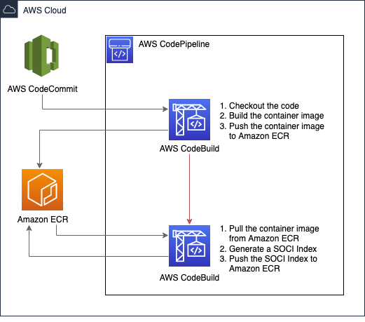

# Generating SOCI Indexes within a CI/CD Pipeline

Before you can lazy load a container image with the SOCI Snapshotter it needs to
be indexed. To do so, you can use the `soci`
[cli](https://github.com/awslabs/soci-snapshotter/tree/main/cmd/soci), and run
the `soci create` command against a local container image.

However, most container images are built as part of a CI/CD pipeline.
Therefore this repository attempts to provide a blueprint of how to build a SOCI
Index as part of a pipeline. The example in this repository is based on [AWS
CodePipeline](https://aws.amazon.com/codepipeline/) and [AWS
CodeBuild](https://aws.amazon.com/codebuild/), but the hope is that this
blueprint and the stages of the pipeline can be transferred to other CI/CD
Pipelines.

# Pipeline Architecture

This pipeline has the following architecture:

 

1. Stage 1 of the pipeline builds the container image. This is a common pattern
   with AWS CodeBuild. Within the CodeBuild environment the execution
   environment is privileged, so you can perform a container image build with
   `docker build`.

2. Stage 2 of the pipeline creates the SOCI Index. Within this CodeBuild
   environment we run our own instance of containerd. This is because the `soci`
   cli can only index container images stored within the containerd image store,
   not the Docker Engine image store. Therefore the Docker Engine running in the
   AWS CodeBuild execution environment can not be used. Once the containerd
   daemon is running, the rest of the execution involves downloading the
   container image with `ctr image pull` and generating the SOCI Index with
   `soci create`.

## Deploying the Sample Pipeline.

You can deploy the AWS CodePipeline in your AWS Account with the following steps:

1. Deploy the CloudFormation Template.

    ```bash
    aws cloudformation \
        create-stack \
        --stack-name soci-pipeline \
        --template-body file://cloudformation.yaml \
        --capabilities CAPABILITY_IAM
    ```

    This cloudformation template will create the following resources:

    * AWS CodeCommit repository to store the sample application.
    * Amazon ECR repository to store the Container Image and SOCI
      Index.
    * Amazon EventBridge rule to trigger the pipeline on a commit
      being pushed to AWS CodeCommit.
    * AWS CodePipeline with the 2 AWS CodeBuild steps shown in the
      [pipeline architecture](#pipeline-architecture)

    Log into the AWS Console, to verify the cloudformation template has been
    deployed correctly, and the various resources in the AWS Code Suite has been
    deployed successfully.

2. Next we push the Sample Application into the CodeCommit Repository.

   If you have not configured you're local git client to authenticate and push to
   AWS CodeCommit, see the [AWS CodeCommit
   documentation](https://docs.aws.amazon.com/codecommit/latest/userguide/setting-up-ssh-unixes.html).

    ```bash
    git clone https://github.com/ollypom/mysfits.git
    git remote add codecommit ssh://git-codecommit.eu-west-1.amazonaws.com/v1/repos/socidemoapp
    git push codecommit master
    ```

    You can monitor the status of the CodePipeline in the AWS Console. Ensuring
    it has been triggered and the 2 CodeBuilds stages execute successfully.

3. In the AWS Console or using the AWS CLI, check to see that the container
   image along with a SOCI Index have been pushed to Amazon ECR.

   ```bash
   aws ecr list-images --repository socidemoapp
   {
       "imageIds": [
           {
               "imageDigest": "sha256:91bf19a70b1806ae97476fd19a17eea7977c068a0c1e361037cba457c2810d4a"
           },
           {
               "imageDigest": "sha256:a4239937f44e35d790dd8396fc3a215f59d758541d8370459eefc6a286650474",
               "imageTag": "1d2ca213-2121-447f-9a00-9633bb8941be"
           },
           {
               "imageDigest": "sha256:18d7b8d6b11eeae4e4265380fedf51720f3f47fb209cbeefdc395f6d18908693",
               "imageTag": "sha256-a4239937f44e35d790dd8396fc3a215f59d758541d8370459eefc6a286650474"
           }
       ]
   }
   ```